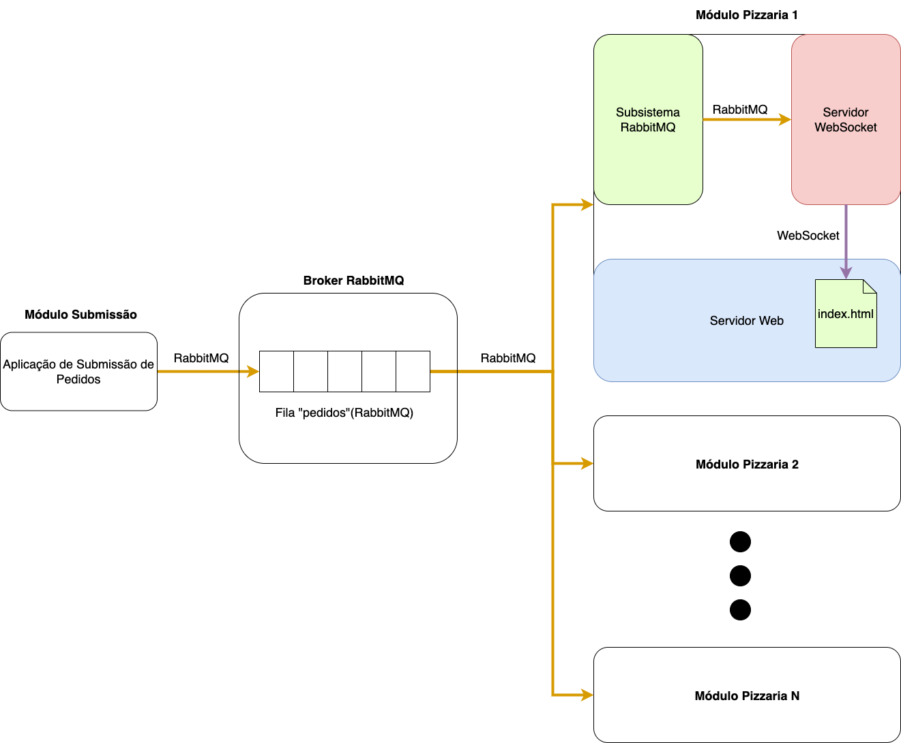
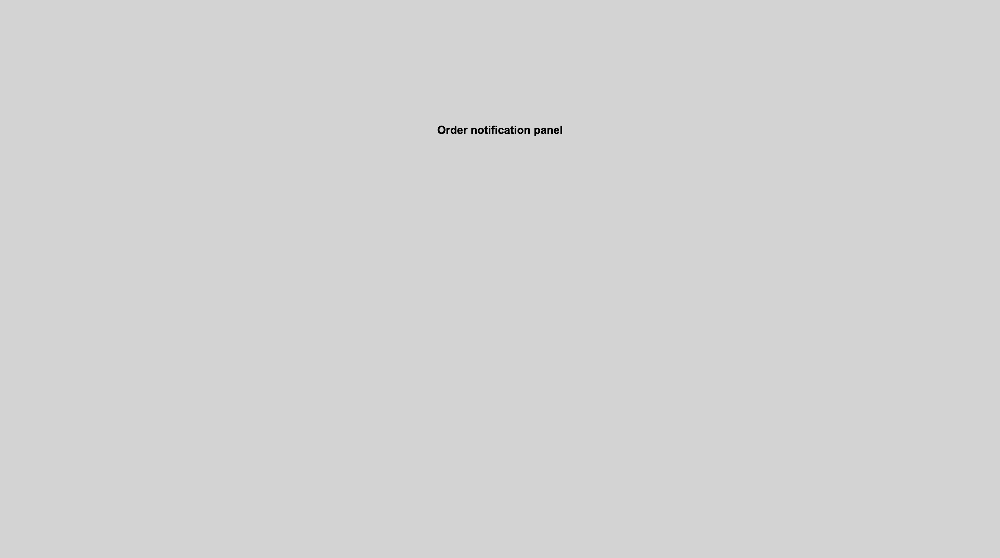
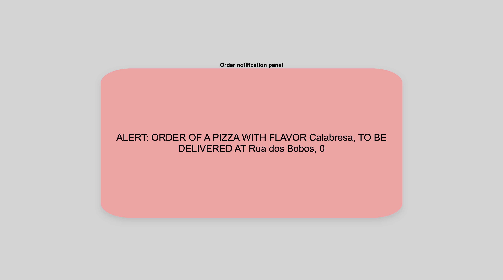

# Rabbit Pizza (Pizzeria Front module)


## Sobre

<p align="center">Small educational project developed to present the concepts of messaging with RabbitMQ middleware for the Distributed Systems course (2021.2) of the Computer Engineering course - UFMA</p>


## Table of Contents
=================

   * [About](#about)
   * [Table of Contents](#table-of-contents)
   * [Project Description](#-project-description)
   * [Prerequisites](#-prerequisites)
   * [Installation](#-installation)
   * [Technologies](#-technologies)
   * [Author](#-author)

---

## 💻 Project Description

The project consists of a simple pizza restaurant *marketplace* which uses a distributed architecture based on the use of RabbitMQ messaging middleware. This system has two main subsystems: (a) the "Order Submission" module and (b) the "Pizzeria Front" module.

The "Order Submission" module is responsible for generating orders and placing them in a queue, managed by a RabbitMQ *broker*. These orders must be fulfilled by one of the pizzerias registered in the system. They are notified through the "Pizzeria Front" module, which is responsible for receiving delivery requests for a given pizza flavor at an address.

Upon receiving a request, the "Pizzeria Front" module then forwards the request to a notification subsystem, which uses WebSockets to distribute the alert to the notification panels (represented by a simple web page).

Both modules were implemented and made available in the following projects:
- [Rabbit Pizza (Pizzeria Front module)](https://github.com/rafaelfl/rabbitmq-front-sd-2021-2)
- [Rabbit Pizza (Order Submission module)](https://github.com/rafaelfl/rabbitmq-sd-2021-2)

The architecture of the described system can be seen in the following image.



---

<a name="prerequisites"></a>
## ⚙️ Prerequisites

Before starting, you will need a RabbitMQ *broker* installed at some address. I recommend using a Docker *container*, which can be installed using the following command (considering the latest version so far):

```
docker run -it --rm --name rabbitmq -p 5672:5672 -p 15672:15672 rabbitmq:3.9-management
```

---

## 🚀 Installation

After running the RabbitMQ *broker* and download this project, you must configure the project's .env file, defining, in the `BROKER_ADDRESS` and `PORT` variables, the ip address and port of your RabbitMQ broker (the default localhost:8080).

```bash
# Clone this repository
$ git clone https://github.com/rafaelfl/rabbitmq-front-sd-2021-2

# Access the project folder (using terminal/cmd)
$ cd rabbitmq-front-sd-2021-2

# Install the dependencies
$ yarn install

# Edit the .env file with your configurations

# Run the "Pizzeria Front" module using the following syntax
$ yarn start

# The web/websocket server will start by default on port:8080 and the queues will be
# accessed at localhost address

# Open <http://localhost:8080> in your browser - you will see an initially blank page -
# when receiving a pizza order, a box will be displayed in the middle of the screen
```

To view the pizza orders, it is necessary to run the "Order Submission" module available in the repository [Rabbit Pizza (Order Submission module)](https://github.com/rafaelfl/rabbitmq-sd-2021-2). When using the tool to submit pizza orders, you will see the notification box appear in your browser.

If you need to restart the web server, don't forget to refresh the page (since it connects to the WebSocket server on page load).

### Screenshots:

<table>
  <tr>
    <td>Monitor page</td>
    <td>Alert page</td>
  </tr>
  <tr>
    <td></td>
    <td></td>
  </tr>
 </table>

---

## 🛠 Technologies

The following technologies were used to build this project:

- [Node.js](https://nodejs.org/en/)
- [Yarn](https://yarnpkg.com/)
- [ws: a Node.js WebSocket library](https://github.com/websockets/ws)
- [RabbitMQ](https://www.rabbitmq.com/)
- [AMQP](https://github.com/amqp-node/amqplib)

---

## 🦸 Author

<a href="https://github.com/rafaelfl/">
 
 <br />
 <sub><b>Prof. Rafael Fernandes Lopes, Ph.D.</b></sub></a>


Developed with 💜 by Rafael Fernandes Lopes

[](https://www.linkedin.com/in/rafael-fernandes-lopes/)
